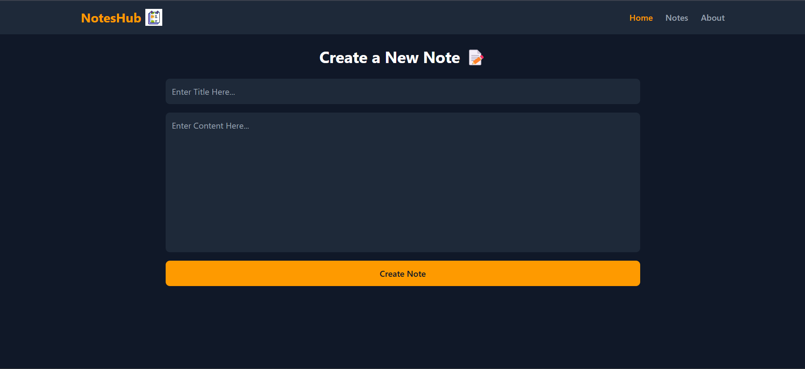
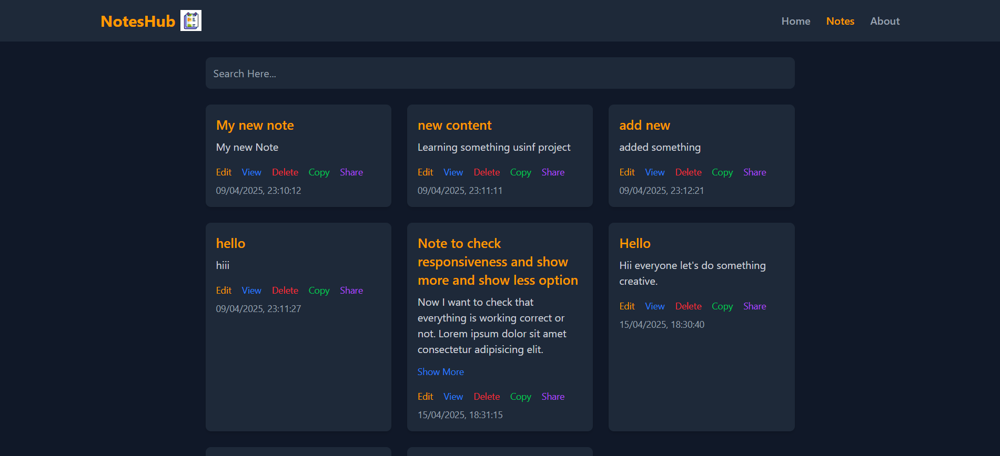

# 📝 NotesHub - Your Personal Note-Taking Companion

Welcome to **NotesHub**! 🎉 NotesHub is a sleek and intuitive note-taking application designed to help you organize your thoughts, ideas, and tasks effortlessly. Whether you're jotting down quick notes or creating detailed plans, NotesHub has got you covered! 🚀

---

## 📚 Table of Contents

- [🎨 Screenshots](#-screenshots)
- [🌐 Live Demo](#-live-demo)
- [🌟 Features](#-features)
- [🖥️ Tech Stack](#️-tech-stack)
- [🚀 Getting Started](#-getting-started)
- [📂 Project Structure](#-project-structure)
- [🤝 Contributing](#-contributing)
- [📜 License](#-license)
- [❤️ Acknowledgments](#%EF%B8%8F-acknowledgments)
- [🌐 Connect with Me](#-connect-with-me)

---

## 🎨 Screenshots

### 🏠 Home Page

### 📝 Notes Page

---

## 🌐 Live Demo

Check out the live demo here: 🔗 [NotesHub Live Demo](https://notes-hub.vercel.app) 🌍

---

## 🌟 Features

✨ **Create Notes**: Quickly jot down your ideas and thoughts.  
🔍 **Search Notes**: Easily find notes using the search functionality.  
✏️ **Edit Notes**: Update your notes as your ideas evolve.  
🗑️ **Delete Notes**: Remove notes you no longer need.  
📊 **Organized View**: View all your notes in a clean and structured layout.  
🔗 **Share Notes**: Generate shareable links for your notes.   
💾 **Persistent Storage**: Your notes are saved in your browser's local storage, so they won't disappear on refresh!  
📱 **Responsive Design**: Fully adaptive for mobile, tablet, and desktop devices, ensuring a seamless experience on any screen size.  

---

## 🖥️ Tech Stack

- **Frontend**: React ⚛️  
- **State Management**: Redux Toolkit 🛠️  
- **Styling**: TailwindCSS 🎨  
- **Routing**: React Router 🌐  
- **Notifications**: React Hot Toast 🔔  
- **Build Tool**: Vite ⚡  

---

## 🚀 Getting Started

Follow these steps to run NotesHub on your local machine:

### 1️⃣ Clone the Repository

    git clone https://github.com/AlokKumarYadav2410/notes-hub.git
    cd notes-hub

### 2️⃣ Install Dependencies
    npm install

### 3️⃣ Install Tailwind CSS
    npm install tailwindcss @tailwindcss/vite

### 4️⃣ Install React Redux
    npm i react-redux

### 5️⃣ Install  React-Router-DOM
    npm i react-router-dom

### 6️⃣ Toast Notifications
    npm install react-hot-toast

### 7️⃣ Start the Development Server
    npm run dev

### 8️⃣ Open in Browser
    Visit http://localhost:5173 to see GitPDF in action! 🎉
    or
    http://localhost:5174
